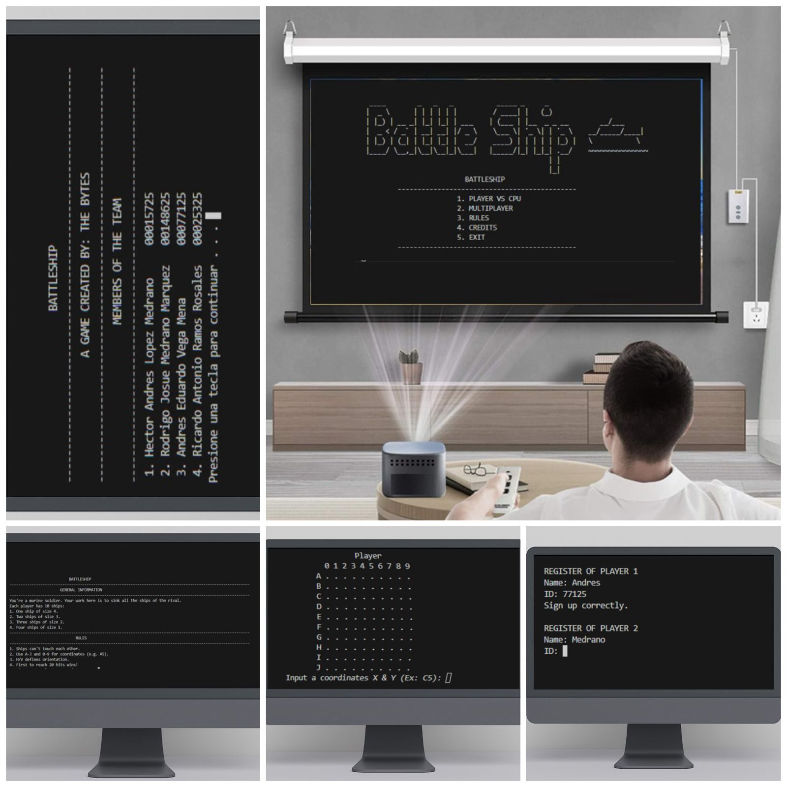

# NAME OF THE GAME: BATTLESHIP 🚢

### *This is a story that all great-grandparents have told from generation to generation. One day you visited your grandfather and during lunch you said out loud: "Grandpa, tell me that story again, about when you sailed the seven seas because of the war."*

### *Your grandfather just looks at you with a smile and says, "Okay, son, this is the story of the battleship..."*

#### DESCRIPTION OF THE GAME

Battleship is a game focused on strategy and the destruction of enemy ships. In Battleship, you'll embark on an adventure against the Intelligent CPU, a machine trained to guess the possible locations of your ships. This game is a non-stop experience where the winner is the one who manages to destroy all of their opponent's ships. Think you can beat it? If you don't think you can, you can practice against a friend with the multiplayer option.

All the mariners has these ships:

- Leviatan: It is the largest warship of all time. You only have one of this.

- Bombers : These have great strength and hardness. You only have two of these.

- Ironclad : These ships seek to hide among other ships. You only have three of these

- Sneaky : These ships are the kings of stealth. You only have four of these.


## BATTLESHIP GAMEPLAY
-------------------------------------------------------------------------------------------------------------------------
-------------------------------------------------------------------------------------------------------------------------
#### 1. All players will have a 10x10 board where they can place their ships.
  
#### 2.To shoot, you must first place the Y coordinate and then the X coordinate, for example (C4), where C is a point within the "Y" coordinate and 4 is a point within the "X" coordinate.

#### 3. To make it more exciting, for every hit on a ship, whether it's yours or yours, 1 will be added to the score counter.

#### 4. Turns to shoot at coordinates will be alternated between players.

#### 5. Players marked the results on their attack board to keep track of their attempts and successes.

#### 6. The first player to sink the entire enemy fleet and score 20 points wins.

-------------------------------------------------------------------------------------------------------------------------
-------------------------------------------------------------------------------------------------------------------------

## TOPICS SEEN IN FUDP

1. If else, else if: They were used to control the board's measurement parameters so that no ship was placed outside the boundary. They were also used to verify whether the space for placing a ship was free or already used, and whether the shot hit a ship or not.

2. Arrays: We used tweaks for generating the entire board, both for the computer in vs. CPU mode and for multiplayer. We also used tweaks for placing ships on the board and for better handling of shooting per turn.

3. For: For is used to traverse within each board when placing ships. It's also used to traverse it to fire from a position. We also use it to identify the ship's area.

4. While, do while: We primarily use it to create menus, so the user can play the game as many times as they want. We also used the while loop to verify whether the coordinates entered by the user are valid for the board or not. We have the user type them in until they are correct. 

5. Switch: It was used to confirm in which direction the boat is placed, horizontal or vertical.

6. Functions: They were used to make the code much more readable, organized, and not overload the main branch. Each part of the game is defined by a function that is only called.

7. Files:We use file management to keep track of the last few players who played the game. Mainly to keep track of all the players. To do this, we ask for their name and ID.

--------------------------------------------------------------------------------------------------------------------------------------------------------------------------------------------------------------------------------------------------
## MOCKUP OF BATTLESHIP




## TEAM

- **Name of the team:** [The bytes]

### Members of the team

1. **Name:** [Hector Andres Lopez Medrano]  
   **Carnet:** [00015725]

2. **Name:** [ Rodrigo Josue Medrano Marquez]  
   **Carnet:** [00148625]

3. **Name:** [Andres Eduardo Vega Mena]  
   **Carnet:** [00077125]

4. **Name:** [Ricardo Antonio Ramos Rosales]  
   **Carnet:** [00025325]


## Instructions to execute

1. Clone this repository in your local machine (in the desktop):
   ```bash
   git clone [https://github.com/FDP-01-2025/project-the-bytes.git]

2. Open Visual Studio Code and open the folder with the name "project-the/bytes"

3. Once you are inside the folder, open a new terminal and type this to compile and run the game:
   ```bash
   g++ Battleship.cpp -o Battleship.exe -lwinmm

4. Just enjoy it...
   